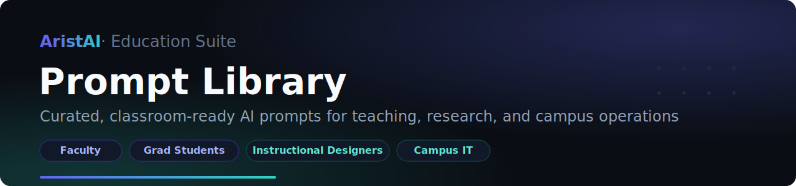

### Expert-level AI output for your campus — no prompt engineering degree required.

  

Great AI results start with great instructions. The **AristAI Prompt Library** is a curated collection of scenario-specific prompts — each one scoped to a single job, with output format and quality constraints built in — so faculty, graduate students, instructional designers, and campus IT teams can copy, paste, and get dependable results from ChatGPT, Claude, Gemini, or any modern model.

No tuning marathons. No "universal mega-prompt" that does everything poorly. Just the right prompt for the task at hand.

## Who this is for

| You are… | Start here |
| --- | --- |
| 🎓 **A graduate student or faculty member** writing a thesis, dissertation, or paper | Academic writing prompts: outline review, chapter drafting, polishing, reference management, translation |
| 🏫 **An instructional designer or educator** building course materials | Diagram generators for concept maps, architecture visuals, and exam-style figures (Draw.io / Excalidraw) |
| 💻 **A campus IT or edtech developer** shipping student-facing tools | A five-step development workflow — requirements → design → implementation → review → bug fix — plus production-quality frontend design prompts |
| 📋 **A department chair or administrator** reporting up | Turn fragmented notes into polished weekly reports, committee updates, retrospectives, and program introductions |
| 📣 **A communications or marketing team member** | Article writing with nine selectable writing styles, plus style extraction from your existing content |

## What's inside

| Category | What you get |
| --- | --- |
| 🎓 **Academic writing** | Full thesis workflow: outline review, chapter drafting in your discipline's structure, polishing, references, AI-detection-aware revision, CN↔EN translation |
| 📊 **Diagrams as code** | Draw.io and Excalidraw generators for system architecture, E-R diagrams, tech stacks, data structures, and style-matched figures |
| 💻 **Development workflow** | Five prompts covering the full software lifecycle, one per phase — built for teams shipping campus applications |
| 📋 **Reports & documentation** | Weekly reports, status updates, retrospectives, and project/program introductions with conclusion-first structure |
| ✍️ **Content creation** | Long-form article writing, headline generation, layout polish, and reusable style extraction from sample content |
| 🎨 **Frontend design** | Production-grade, aesthetically opinionated UI prompts — no "generic AI look" on your student portals |
| 🔧 **Tools & extensions** | Multi-language code review, agent Skill creation, and Skill ↔ Prompt conversion |

Browse everything in [`prompts/`](prompts/).

## Quick start

1. Open the `.md` file for your scenario in [`prompts/`](prompts/)
2. Copy the full prompt (from `# Role` through `# Input`, code blocks included)
3. Paste it into your AI assistant of choice
4. Fill in your content at the marked placeholders — done

> ⚡ **Prefer zero copy-paste?** Every major scenario also ships as an auto-invoked agent Skill for Claude Code, Cursor, and Codex — see the companion [AristAI Skill Library](https://github.com/aristai-support/best-skills).

## A note on language

This library builds on an excellent upstream project authored in Chinese. The prompt files retain their original Chinese text — they perform well with all frontier models regardless of your conversation language, and English-localized editions for U.S. campuses are on our roadmap. Contributions welcome.

## About AristAI

[AristAI](https://aristai.io) is an AI education suite for higher education: a **24/7 AI Tutor** that integrates with any LMS, an **AI Accessibility Suite** for scalable WCAG 2.2 compliance, and an **AI Program Mapper** that strengthens academic programs with curriculum insights. This library is part of our commitment to helping campuses put AI to work — practically, accessibly, and well.

Questions or ideas? Reach us at [aristai.io](https://aristai.io).

## Credits & license

Forked from [xstongxue/best-prompts](https://github.com/xstongxue/best-prompts) — our thanks to the original author. Licensed under [Apache 2.0](LICENSE).
